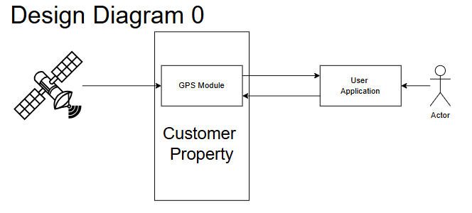
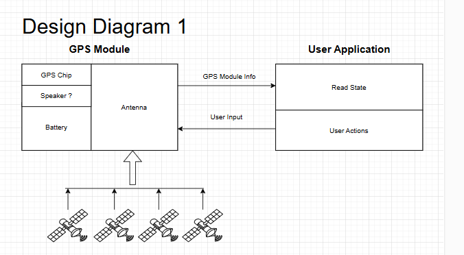
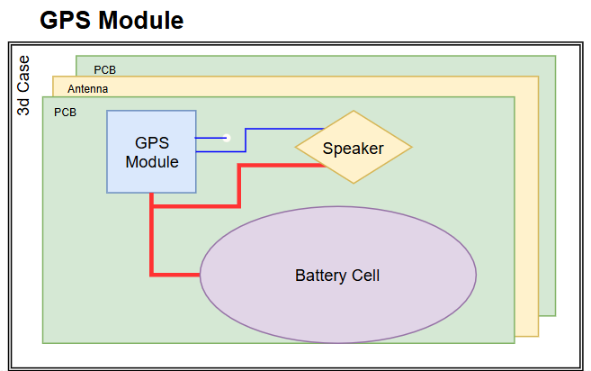
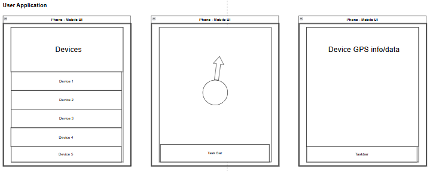

# Senior Design 

## Team Name: KCN
## User Stories

User 1:
As an engineer I would like to not lose track of my tools so I don't spend extra time searching

User 2:
I am social butterfly and am constantly losing track of my wallet, I would like to easily find where my wallet went. 

User 3:
I am a warehouse manager and want to keep track of my companies tools as they are signed out, this will increase manageability of my fleet. 

## Design Diagram 0

Design 0 diagram gives a high level overview of the project. The GPS and customer property blocks represent pyhsical objects vs our user interface will be an interactable virtual object. The arrows represent inputs/outputs to and from objects, such as GPS signal, GPS pings, etc. 

- GPS Module - Gathers satellite data and send data to 
- User Application - Takes inputs from both GPS module and User to gather GPS data and configure GPS module

## Design Diagram 1

The GPS module block represents the encasing that will house the antenna, GPS chip, battery, and possibly a speaker. The antenna will receive the radio waves from the four satellites to determine its position. The GPS chip will send and receive the data from the User application as well as reading the information gathered by the antenna. The battery will power everything in the module and the speaker will play a sound when the GPS chip tells it to. The user application block represents the mobile app that reads information from the GPS chip as well as allow the user to send inputs to the GPS chip. The read state will read any inputs from the GPS chip, which is represented by the GPS module info arrow, and the user actions will allow the user to send inputs to the GPS chip as shown by the user input arrow..

- GPS Module - Gathers satellite 
- User Application - Takes inputs from both GPS module and User to gather GPS data and configure GPS module

## Design Diagram 2

The GPS module will be a PCB design that attempts to be as thin as possible. This should be possible by using a layer of the PCB to be an antenna and the rest are necessary components. The UI should be designed for easy fleet managment and device location. 

- GPS Module - Gathers satellite 
- User Application - Takes inputs from both GPS module and User to gather GPS data and configure GPS module

